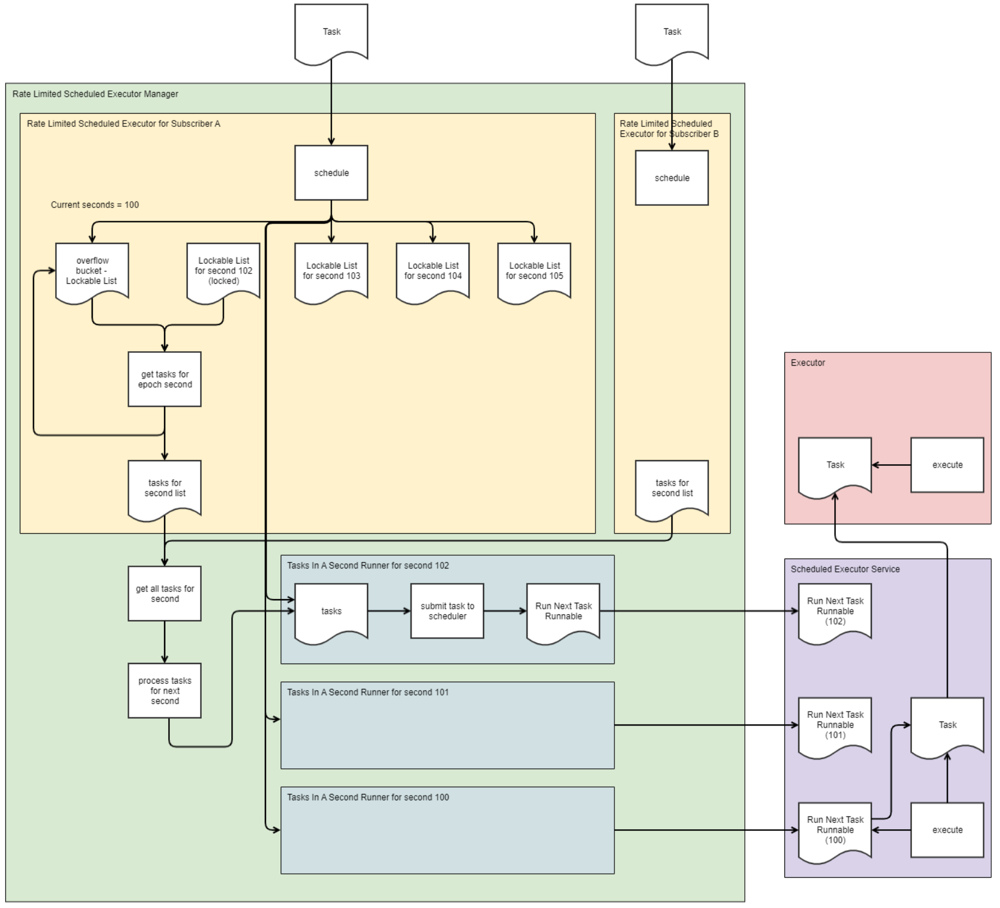

# Rate Limited Scheduled Executor Service 
Rate Limited Scheduled Executor Service is a component which allows for scheduling future events, which will then be executed. Above the normal inbuilt schedulers, it has the following features :

* Implements all of the ScheduledExecutorService, so can be used behind whatever framework you like
* Each executor can have a separate TPS limit
* if the limit is to be exceeded, a sort order can be applied to determine which tasks should be given priority
* tasks can be timed out after a given amount of time
* the overall performance of the scheduler for a high-throughput usecase (thousands of TPS overall) is higher than the inbuilt schedulers
* detect other running scheduled executors on the network, and divide the TPS between them accordingly (at the moment the only implementation of this is Redis)

Compared to a normal scheduler, there are the following limitations 
* tasks may not be effectively scheduled for execution within the next interval (default 1 second). 
  * If a task is scheduled within this time, it will be executed in the next 'bucket' which is to processed, typically in 1 seconds time (it is not rejected)
* tasks are scheduled within a given interval (default 1 second). The moment at which they are executed within that second is ignored - so a task could execute up to 0.999 seconds earlier than the scheduled time (assuming scheduling in milliseconds) - this is controllable
* tasks may execute any amount of time after the schedule time, up to the timeout
* tasks are sent for execution asynchronously, which means if the execution thread is busy they may execute even later than that 


## Usage

Please see the separate [usage instructions](./usage.md) for more details

## Architecture

Below is an architecture diagram. The following steps are loosely followed
1) a task is scheduled against the Rate Limited Scheduled Executor (which is a single bucket within the overall executor manager) 
2) the schedule function puts the request in a bucket given the interval it should be scheduled in. If a bucket doesn't exist, one is created, or if it is too soon (and the bucket is already locked or processed), it tries to drop the task directly into the task runner, otherwise it is put in the 'overflow' bucket
3) every interval, the get all tasks for interval process (in the Rate Limited Scheduled Executor Manager) calls the 'get tasks for epoch second' function in each executor. 
4) the get tasks for interval function pulls in all records from the right bucket, and the overflow bucket. They are filtered to ignore records which have been cancelled or timed out. If these fit within the TPS they are immediately sent to the manager
5) otherwise the records are sorted according to the sort criteria, the correct number of records is returned to the manager, and the remaining tasks are placed back into the overflow bucket
6) once the manager has the messages from each executor, it combines them, and creates a new Interval Runner. 
7) the runner schedules a single job on a (supplied) scheduled executor service - the single job is timed to shuffle the tasks, then start at the head of the correct interval, then run every n nanoseconds (where n is 1,000,000,000/number of tasks).
8) the executor service picks up the job at the start of the interval, and the task simply calls the (supplied) executor to execute the task itself. 
9) If there are no remaining tasks, the job on the executor service is cancelled, otherwise it runs again and applies the same job  




## Typical performance stats
```
JVM scheduling for 20000000 was done in 33196ms (602482TPS) execution was done in 93418ms (214091TPS)  total is 126615ms (157959TPS)  with 0 tasks remaining  
new scheduling with small interval for 20000000 was done in 7462ms (2680246TPS) execution was done in 58547ms (341605TPS)  total is 66009ms (302988TPS)  with 0 tasks remaining  
new scheduling with large interval for 20000000 was done in 104961ms (190546TPS) execution was done in 5449ms (3670398TPS)  total is 110410ms (181143TPS)  with 0 tasks remaining  
new scheduling with no buffer for 20000000 was done in 9950ms (2010050TPS) execution was done in 48643ms (411158TPS)  total is 58593ms (341337TPS)  with 0 tasks remaining  
new scheduling with large buffer for 20000000 was done in 58787ms (340211TPS) execution was done in 5290ms (3780718TPS)  total is 64078ms (312119TPS)  with 0 tasks remaining  
new scheduling with defaults for 20000000 was done in 36523ms (547600TPS) execution was done in 10876ms (1838911TPS)  total is 47399ms (421949TPS)  with 0 tasks remaining  
```

long term memory use stats below (100 TPS for 20 minutes)

```
memory used is 4290kb out of max4188012kb. We have 22 threads  
memory used is 4665kb out of max4188012kb. We have 23 threads  
memory used is 4662kb out of max4188012kb. We have 23 threads  
memory used is 4663kb out of max4188012kb. We have 23 threads  
memory used is 4671kb out of max4188012kb. We have 23 threads  
memory used is 4664kb out of max4188012kb. We have 23 threads  
memory used is 4668kb out of max4188012kb. We have 23 threads  
memory used is 4685kb out of max4188012kb. We have 23 threads  
memory used is 4675kb out of max4188012kb. We have 23 threads  
memory used is 4669kb out of max4188012kb. We have 23 threads  
memory used is 4669kb out of max4188012kb. We have 23 threads  
memory used is 4660kb out of max4188012kb. We have 23 threads  
memory used is 4673kb out of max4188012kb. We have 23 threads  
memory used is 4668kb out of max4188012kb. We have 23 threads  
memory used is 4676kb out of max4188012kb. We have 23 threads  
memory used is 4665kb out of max4188012kb. We have 23 threads  
memory used is 4674kb out of max4188012kb. We have 23 threads  
memory used is 4672kb out of max4188012kb. We have 23 threads  
memory used is 4658kb out of max4188012kb. We have 23 threads  
memory used is 4666kb out of max4188012kb. We have 23 threads  
```


## Contributing

We welcome Your interest in the American Express Open Source Community on Github. Any Contributor to
any Open Source Project managed by the American Express Open Source Community must accept and sign
an Agreement indicating agreement to the terms below. Except for the rights granted in this 
Agreement to American Express and to recipients of software distributed by American Express, You
reserve all right, title, and interest, if any, in and to Your Contributions. Please
[fill out the Agreement](https://cla-assistant.io/americanexpress/<YOUR REPOSITORY NAME>).

## License

Any contributions made under this project will be governed by the
[Apache License 2.0](./LICENSE.txt).

## Code of Conduct

This project adheres to the [American Express Community Guidelines](./CODE_OF_CONDUCT.md). By
participating, you are expected to honor these guidelines.